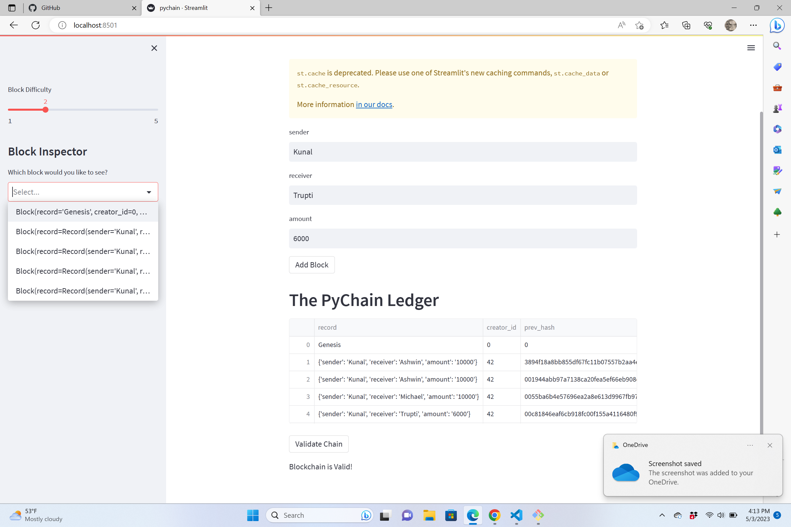

# CU-Fintech-202211-BlockChain

This program contains a blockchain based ledger system which facilitates transfer of money between sender and receiver and is complete with verification functionality to ensure the integrity of the data in the ledger. 

---
## Technologies

In order to access the application in the browser `streamlit` library is used. Streamlit allows  building web interfaces for your Python applications.

---
## Installation Guide

To install `streamlit` use the following command in the dev environment. 

```python
pip install streamlit
```
---
## Usage
Navigate to the location of the program in the terminal and access the application by running the following command in the development environment

```python
streamlit run pychain.py
```

Working of the application can be reviewed in the screenshot below:

a. Initial screen
b. "Add Block" functionality
c. "Validate Chain" functionality which prints "Blockchain in Valid!"
d. "Block Inspector" functionality to review each of the blocks in the chain



---

## Contributors


Kunal Srinivasan

---

## License

2022 edX Bootcamps 